<div align="center">

# DramaChain Bench

### An End-to-End Benchmark for Short-Drama Generation

**From Production Pipeline and Annotation System to Validated Automated Evaluation**

Haoyuan Shi<sup>1</sup> &nbsp; Mingtao Chen<sup>1</sup> &nbsp; Shuo Jiang<sup>1</sup> &nbsp; Ziyan Chen<sup>1,2</sup><br>
Xuyi Sheng<sup>3</sup> &nbsp; Yiming Liu<sup>1</sup> &nbsp; Ying Zhang<sup>1</sup> &nbsp; Miao Wang<sup>1,4</sup><br>
Jianxiang Lu<sup>1</sup> &nbsp; Fanyang Lu<sup>1</sup> &nbsp; Songyuanyi Lu<sup>1</sup> &nbsp; Xiele Wu<sup>1</sup><br>
Zhichao Hu<sup>1,†</sup> &nbsp; Lilin Wang<sup>1</sup> &nbsp; Yuhong Liu<sup>1</sup> &nbsp; Richeng Xuan<sup>1,§</sup>

<sup>1</sup>Hunyuan, Tencent &nbsp;&nbsp; <sup>2</sup>Beijing Film Academy &nbsp;&nbsp; <sup>3</sup>Peking University &nbsp;&nbsp; <sup>4</sup>Shenzhen University

<sup>†</sup>Project Lead &nbsp;&nbsp; <sup>§</sup>Corresponding Author

</div>

---

## Abstract

Commercial short-drama production runs as a chain — script, storyboard, keyframes, shot video, finished drama — but benchmarks score only the video stage, on inputs written for the test rather than produced by a pipeline. So no one can say which stage caused a delivery defect, or how far it travelled.

**DramaChain Bench** scores every stage of a full production chain, on items that chain itself produced. Five evaluation axes are instantiated at six granularities into 63 leaf dimensions, over 5,785 items. Three professional annotators score each item independently with every defect localised in space and time, giving 17,488 scores and 255,925 traceable attributions. An agentic judge then reproduces that board at a mean PLCC of 0.918 — enough to admit new models at no annotation cost.

<div align="center">
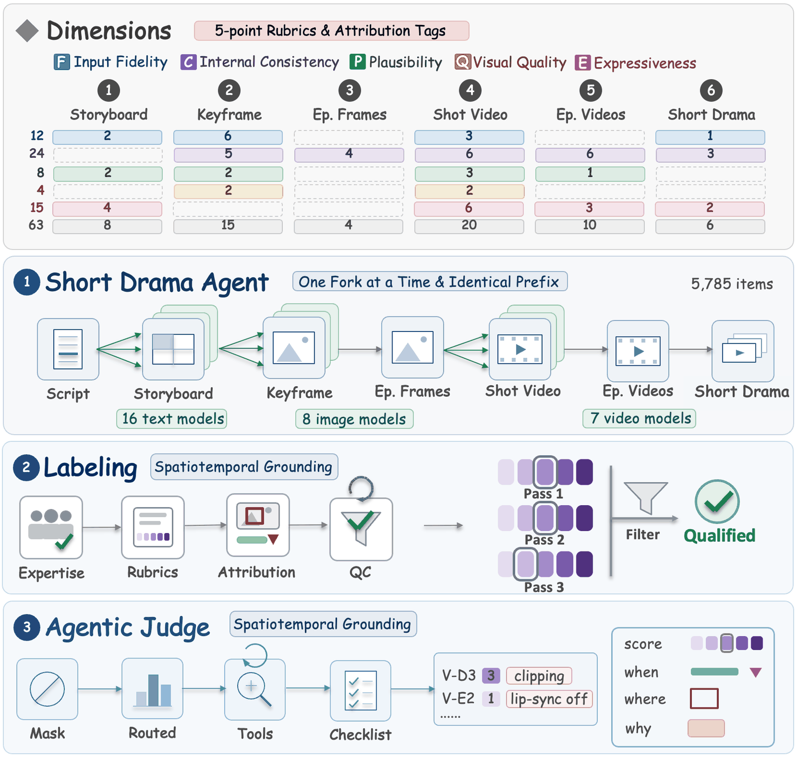
</div>

---

## Highlights

- **The best chain today barely clears the usable line.** `gpt-5.5-xhigh` → `gpt-image-2` → `seedance-2.0` delivers a finished drama at 3.30, only 0.3 above 3.0.
- **Upstream defects accumulate rather than stay local.** Degrading one upstream stage costs a single clip 0.07–0.13 points but the finished drama 0.25–0.83.
- **Quality decays along the chain.** 3.78 at storyboard design down to 2.93 at episode video; no pixel or video stage reaches the text stage's mean.
- **Composite scores hide dimensional trade-offs.** `seedream-5.0-pro` and `nano-banana-pro` differ by 0.02 overall, but by 0.39 and 0.60 on two axes in opposite directions.

---

## Leaderboard

Automated board, 5-point scale, over six production stages and five evaluation axes. **All** is the cross-axis composite.

| Notation | Meaning |
|---|---|
| **bold** | best value in the column among fully annotated models |
| *italic* | below the 3.0 usable line |
| | each stage shows only the axes defined at its granularity |
| † | added after the annotation round, scored automatically only; excluded from agreement metrics and best-column marking |
| ‡ | partial corpus run (reduced dramas, paradigms or styles); scores from the evaluated subset |

Stage headers give model-level PLCC and SRCC against the three-annotator human board.

<details open>
<summary><b>① Storyboard design</b> &nbsp;·&nbsp; text → text &nbsp;·&nbsp; PLCC 0.936 &nbsp;·&nbsp; SRCC 0.800</summary>

<br>

| Model | F<br>Input fidelity | P<br>Generation plausibility | E<br>Cinematic expressiveness | All |
| --- | --- | --- | --- | --- |
| `gpt-5.5-xhigh` | **4.84** | **3.89** | 4.10 | **4.23** |
| `claude-opus-4.8-max` | 4.51 | 3.80 | **4.19** | 4.17 |
| `hy3` | 4.36 | 3.65 | 3.78 | 3.89 |
| `doubao-seed-2.1-pro` | 4.26 | 3.65 | 3.82 | 3.89 |
| `glm-5.2` | 4.01 | 3.66 | 3.74 | 3.79 |
| `gemini-3.1-pro` | 4.08 | 3.43 | 3.67 | 3.71 |
| `kimi-k2.6` | 3.66 | 3.42 | 3.74 | 3.64 |
| `qwen3.7-max` | 3.24 | 3.48 | 3.59 | 3.48 |
| `mimo-v2.5-pro` | *2.68* | 3.53 | 3.41 | 3.26 |
| `gpt-5.6-sol-max` † | 4.95 | 4.02 | 4.31 | 4.40 |
| `claude-fable-5-max` † | 4.55 | 3.99 | 4.20 | 4.24 |
| `claude-opus-5-max` † | 4.45 | 3.85 | 4.30 | 4.22 |
| `kimi-k3` † | 4.67 | 3.87 | 4.17 | 4.22 |
| `qwen3.8-max` † | 4.55 | 3.88 | 3.94 | 4.08 |
| `grok-4.5` † | 3.96 | 3.85 | 3.92 | 3.92 |
| `gemini-3.6-flash-high` † | 4.04 | 3.65 | 3.71 | 3.78 |

</details>

<details>
<summary><b>② Single keyframe</b> &nbsp;·&nbsp; text + refs → pixels &nbsp;·&nbsp; PLCC 0.959 &nbsp;·&nbsp; SRCC 0.750</summary>

<br>

| Model | F<br>Input fidelity | C<br>Internal consistency | P<br>Generation plausibility | Q<br>Visual quality | All |
| --- | --- | --- | --- | --- | --- |
| `gpt-image-2` | **3.65** | **4.32** | **4.47** | **4.13** | **3.99** |
| `gpt-image-1.5` | 3.25 | 3.96 | 4.46 | 3.90 | 3.72 |
| `nano-banana-2` | 3.33 | 3.92 | 4.25 | 3.71 | 3.68 |
| `seedream-5.0-pro` | 3.56 | 3.92 | 3.74 | 3.52 | 3.64 |
| `nano-banana-pro` | 3.17 | 3.89 | 4.34 | 3.79 | 3.62 |
| `wan2.7-image-pro` | *2.95* | 3.63 | 4.03 | 3.46 | 3.38 |
| `seedream-5.0-lite` ‡ | *2.96* | 3.40 | 3.89 | 3.40 | 3.32 |

</details>

<details>
<summary><b>③ Episode keyframes</b> &nbsp;·&nbsp; a whole episode of frames &nbsp;·&nbsp; PLCC 0.973 &nbsp;·&nbsp; SRCC 0.964</summary>

<br>

| Model | C<br>Internal consistency | All |
| --- | --- | --- |
| `gpt-image-2` | **3.82** | **3.82** |
| `gpt-image-1.5` | 3.60 | 3.60 |
| `nano-banana-2` | 3.47 | 3.47 |
| `seedream-5.0-pro` | 3.28 | 3.28 |
| `nano-banana-pro` | 3.04 | 3.04 |
| `wan2.7-image-pro` | 3.00 | 3.00 |
| `seedream-5.0-lite` ‡ | *2.91* | *2.91* |

</details>

<details>
<summary><b>④ Single-shot video</b> &nbsp;·&nbsp; pixels → time + audio &nbsp;·&nbsp; PLCC 0.755 &nbsp;·&nbsp; SRCC 0.829</summary>

<br>

| Model | F<br>Input fidelity | C<br>Internal consistency | P<br>Generation plausibility | Q<br>Visual quality | E<br>Cinematic expressiveness | All |
| --- | --- | --- | --- | --- | --- | --- |
| `seedance-2.0` ‡ | 3.44 | **3.27** | 3.06 | **3.77** | 3.05 | **3.24** |
| `happyhorse-1.1` | 3.34 | 3.21 | 3.04 | 3.43 | 3.08 | 3.18 |
| `kling-3.0-omni` | 3.22 | 3.23 | **3.08** | 3.28 | *2.88* | 3.11 |
| `pixverse-c1` | 3.07 | 3.09 | *2.92* | 3.42 | **3.10** | 3.10 |
| `wan2.7` ‡ | **3.45** | *2.96* | *2.87* | 3.22 | *2.92* | 3.04 |
| `veo-3.1` ‡ | 3.17 | *2.77* | *2.73* | 3.32 | *2.76* | *2.88* |
| `seedance-2.5` †‡ | 3.24 | 3.40 | *2.97* | 3.71 | *2.85* | 3.17 |

</details>

<details>
<summary><b>⑤ Episode video</b> &nbsp;·&nbsp; shots in sequence &nbsp;·&nbsp; PLCC 0.935 &nbsp;·&nbsp; SRCC 0.943</summary>

<br>

| Model | C<br>Internal consistency | P<br>Generation plausibility | E<br>Cinematic expressiveness | All |
| --- | --- | --- | --- | --- |
| `seedance-2.0` ‡ | ***2.96*** | 3.41 | 3.32 | **3.11** |
| `happyhorse-1.1` | *2.84* | **3.64** | 3.37 | 3.08 |
| `kling-3.0-omni` | *2.79* | 3.31 | **3.48** | 3.06 |
| `wan2.7` ‡ | *2.57* | 3.24 | 3.35 | *2.87* |
| `veo-3.1` ‡ | *2.47* | 3.27 | 3.18 | *2.76* |
| `pixverse-c1` | *2.42* | 3.08 | 3.16 | *2.71* |
| `seedance-2.5` †‡ | 3.16 | 3.11 | 3.50 | 3.25 |

</details>

<details>
<summary><b>⑥ Short drama</b> &nbsp;·&nbsp; the finished short drama &nbsp;·&nbsp; PLCC 0.947 &nbsp;·&nbsp; SRCC 1.000</summary>

<br>

| Model | F<br>Input fidelity | C<br>Internal consistency | E<br>Cinematic expressiveness | All |
| --- | --- | --- | --- | --- |
| `seedance-2.0` ‡ | **4.29** | 3.38 | *2.68* | **3.30** |
| `happyhorse-1.1` | 3.82 | 3.38 | ***2.69*** | 3.22 |
| `kling-3.0-omni` | 3.37 | **3.41** | *2.54* | 3.11 |
| `wan2.7` ‡ | 4.12 | *2.80* | *2.59* | *2.95* |
| `pixverse-c1` | 3.05 | *2.88* | *2.58* | *2.81* |
| `veo-3.1` ‡ | *2.67* | 3.07 | *2.44* | *2.79* |
| `seedance-2.5` †‡ | 4.40 | 3.93 | 3.00 | 3.70 |

</details>

---

## The three systems

### DramaChain Agent — item sourcing

<div align="center">
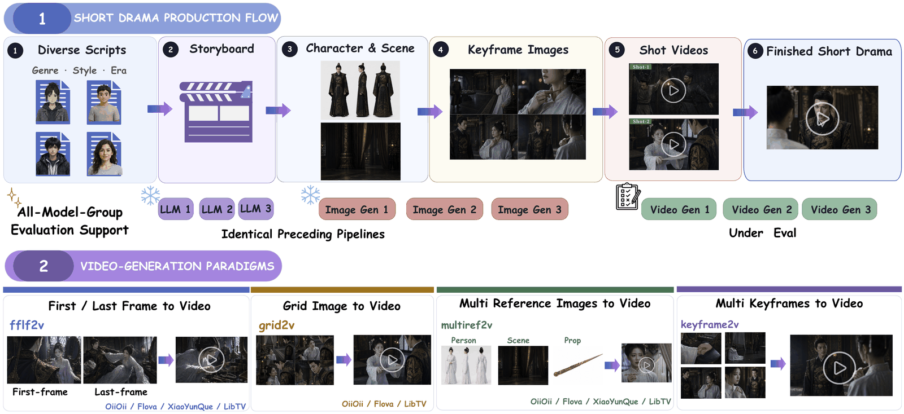
</div>

**What the calibration means.** One script, run end to end by our pipeline and by three commercial short-drama platforms — OiiOii, XiaoYunQue and Flova. Shot segmentation, character and scene consistency, camera language and audio all land in the same band; what differs is house style.

<table>
<tr>
<td width="25%"><a href="assets/video/demo-ours.mp4"></a></td>
<td width="25%"><a href="assets/video/demo-oiioii.mp4">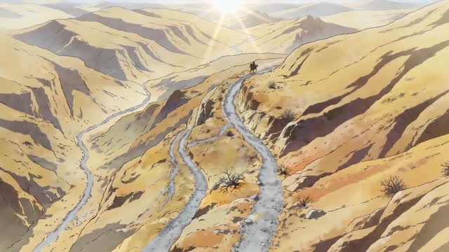</a></td>
<td width="25%"><a href="assets/video/demo-xiaoyunque.mp4"></a></td>
<td width="25%"><a href="assets/video/demo-flova.mp4"></a></td>
</tr>
<tr>
<td align="center"><b>DramaChain Agent</b><br>64.9 s &nbsp;<a href="assets/video/demo-ours.mp4">▶</a></td>
<td align="center">OiiOii<br>97.6 s &nbsp;<a href="assets/video/demo-oiioii.mp4">▶</a></td>
<td align="center">XiaoYunQue<br>43.3 s &nbsp;<a href="assets/video/demo-xiaoyunque.mp4">▶</a></td>
<td align="center">Flova<br>72.4 s &nbsp;<a href="assets/video/demo-flova.mp4">▶</a></td>
</tr>
</table>

All four runs are end to end and fully automatic — no manual editing, frame picking or re-rolling, from one 3-scene / 8-shot script. Their source encodings differed (ours 720p / 24 fps / 2.0 Mbps, OiiOii 720p / 30 fps / 4.7 Mbps, XiaoYunQue 720p / 30 fps / 9.2 Mbps, Flova 1080p / 30 fps / 13.5 Mbps); all four are re-encoded here to 960×540 at roughly 1 Mbps, which removes bitrate as a confound. Clip lengths differ because each pipeline decides its own shot durations from the same script.

Generates the 20 dramas and 60 episodes the benchmark rests on, calibrated against real commercial platforms so a flawed pipeline is not itself what gets measured. It forks at exactly the stage under test — competing models receive identical upstream artefacts, everything else stays fixed.

### DramaChain Labeling System — human reference

<div align="center">
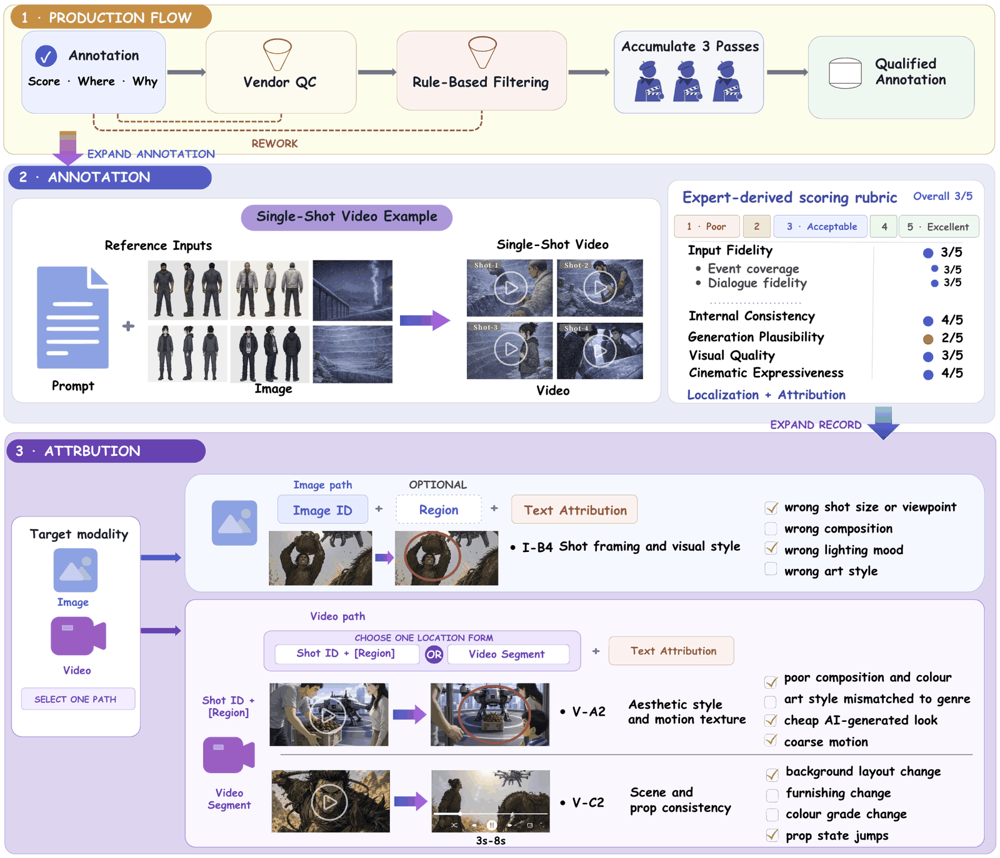
</div>

Three professional annotators independently score every item on all applicable dimensions, using a five-point decidable rubric per leaf dimension. Rubric tiers define observable criteria mapped to a closed vocabulary of attribution tags, and every deduction is localised in space and time. The result is 17,488 scores and 255,925 reviewable attributions contributed by 543 annotators.

### DramaChain Agentic Judge — automated evaluation

<div align="center">
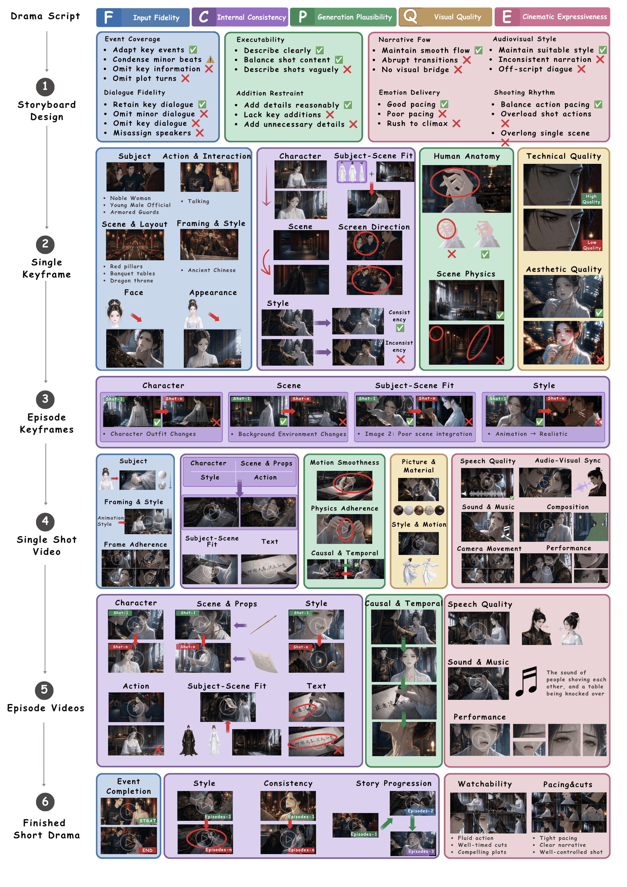
</div>

The judge replicates the human reference automatically. It aggregates routed measurements derived from dimension-specific criteria, may invoke external tools across multiple rounds, and produces final judgements against a per-item checklist. Mean PLCC against the human panel is 0.918.

---

## Case studies

### Equal scores, different failure modes

Two separate items, two models each. All four score 1.3–1.7 on some dimension, so a composite ranks them together — yet the boxes fall in four disjoint places, and within each pair the two models trade which dimension they fail.

**Item 1 — input.** The four character sheets, shared by both models below; identity and costume are fixed here.

<table>
<tr>
<td>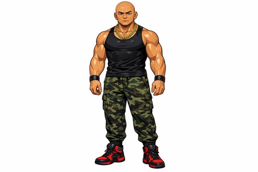</td>
<td>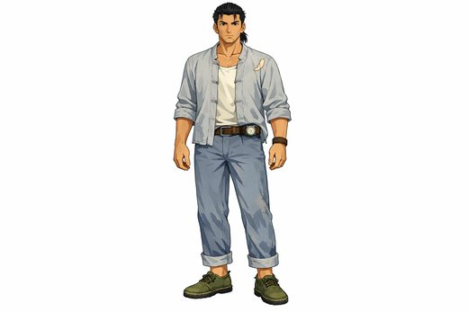</td>
<td></td>
<td>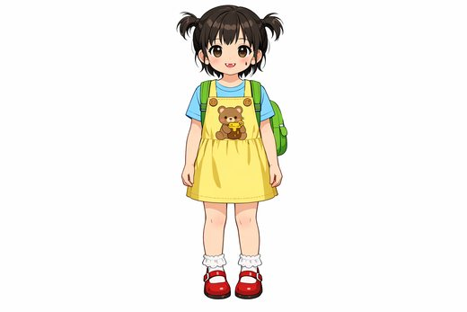</td>
</tr>
<tr>
<td align="center">龚啸</td><td align="center">江临渊</td>
<td align="center">沈知夏</td><td align="center">江念念</td>
</tr>
</table>

<table>
<tr>
<td width="40%">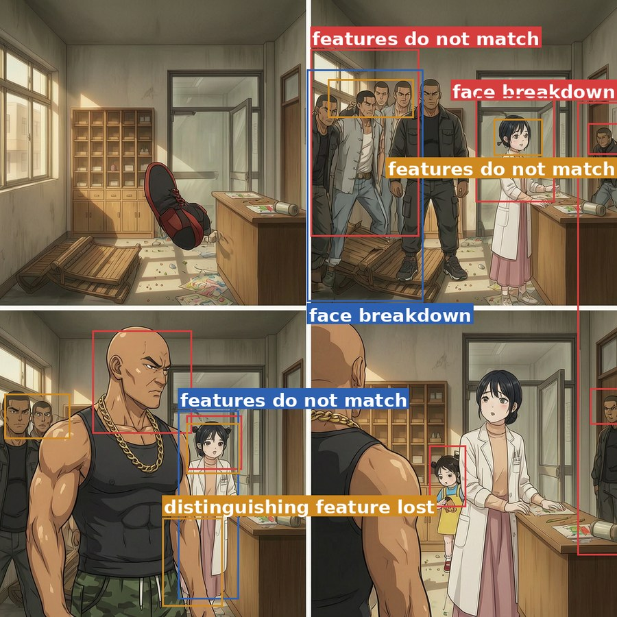</td>
<td width="60%">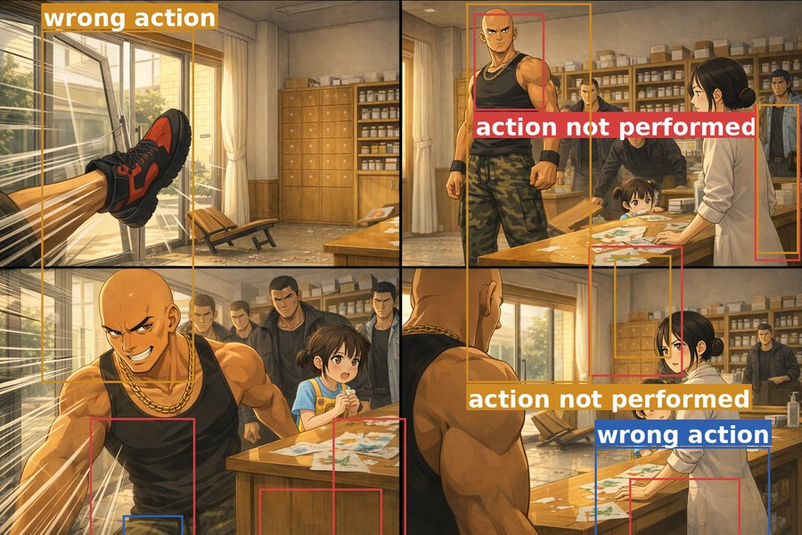</td>
</tr>
<tr>
<td><code>wan2.7-image-pro</code> — I-C1 face identity <b>1.67</b>, 15 boxes, every one on a face; action interaction on this same item scored 3.0.</td>
<td><code>gpt-image-1.5</code> — I-B2 action interaction <b>1.33</b>, 13 boxes, every one on a limb; face identity on this same item scored 3.33.</td>
</tr>
</table>

Boxes are drawn independently by the three annotators; colour distinguishes them. The same white-coated woman is boxed again and again — her identity drifts from panel to panel while the sheets above never change.

**Item 2.** A different item, a different pair of models — and a different pair of dimensions.

<table>
<tr>
<td width="50%">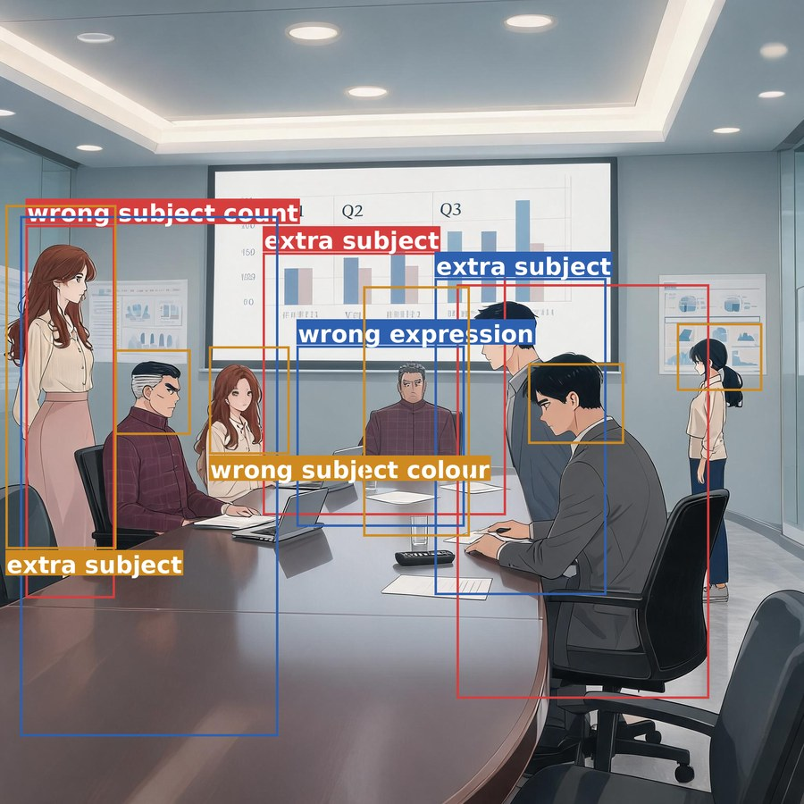</td>
<td width="50%">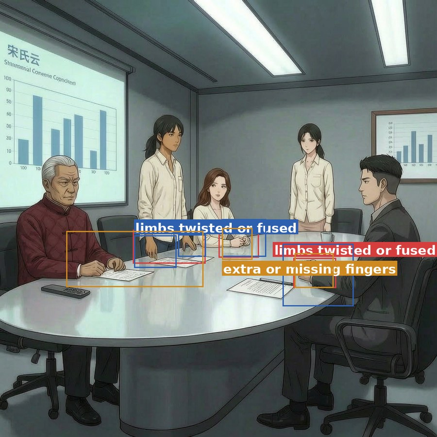</td>
</tr>
<tr>
<td><code>seedream-5.0-lite</code> — I-B1 subject attributes <b>1.33</b>, 12 boxes, all “extra subject”; human anatomy on this same item scored 3.0.</td>
<td><code>wan2.7-image-pro</code> — I-E1 human anatomy <b>1.33</b>, 10 boxes, all broken hands; subject attributes on this same item scored 3.33.</td>
</tr>
</table>

The count is right here and the hands are not, which is the mirror image of the pair above: same band of scores, nothing in common about what went wrong.

### Cross-shot consistency is a separate capability

Same episode, same character sheets. The top row holds its two leads across shots and the bottom row does not — a 2.66-point gap. Every panel in the failing row is defensible on its own: nothing in shot 7 is wrong except relative to shot 5.

**T1 `gpt-image-2`** — MI-D1 cross-shot character consistency **4.33**, alternate shots 1, 3, … 11 of 13

<table>
<tr>
<td>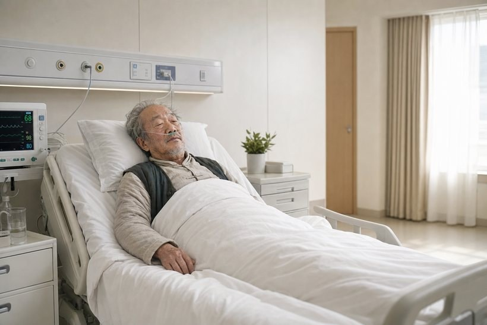</td>
<td>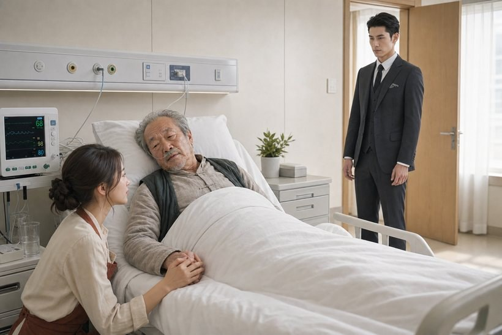</td>
<td>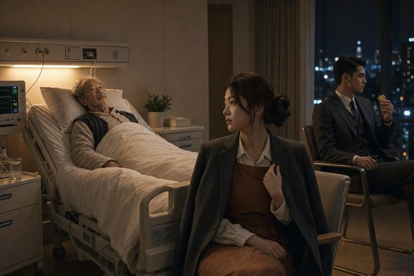</td>
<td>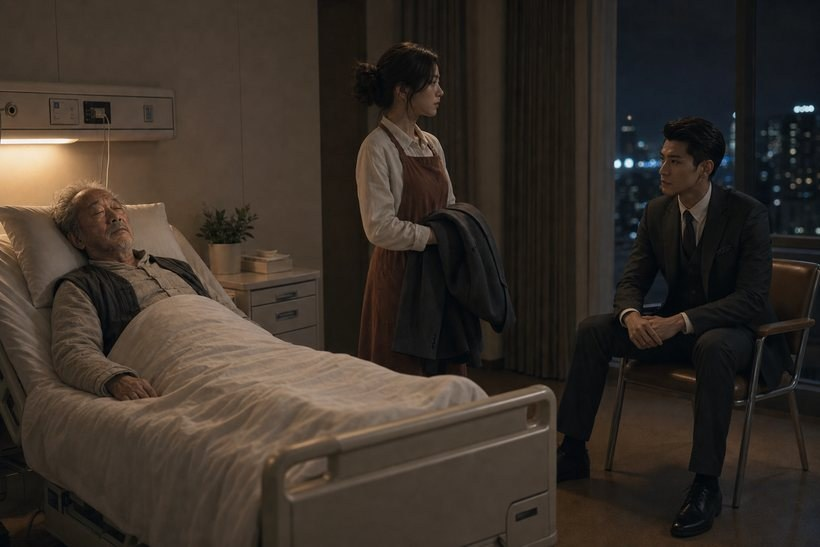</td>
<td>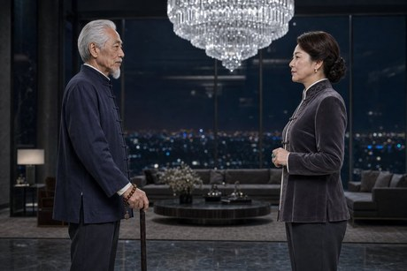</td>
<td>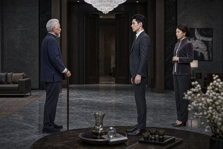</td>
</tr>
<tr>
<td align="center">shot 1</td><td align="center">shot 3</td><td align="center">shot 5</td>
<td align="center">shot 7</td><td align="center">shot 9</td><td align="center">shot 11</td>
</tr>
</table>

**T4 `wan2.7-image-pro`** — MI-D1 cross-shot character consistency **1.67**

<table>
<tr>
<td>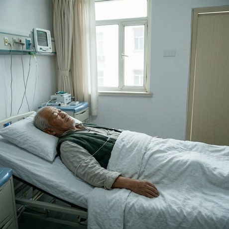</td>
<td>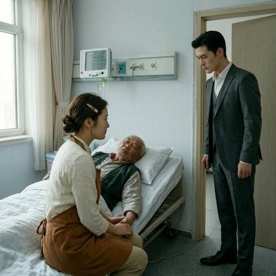</td>
<td>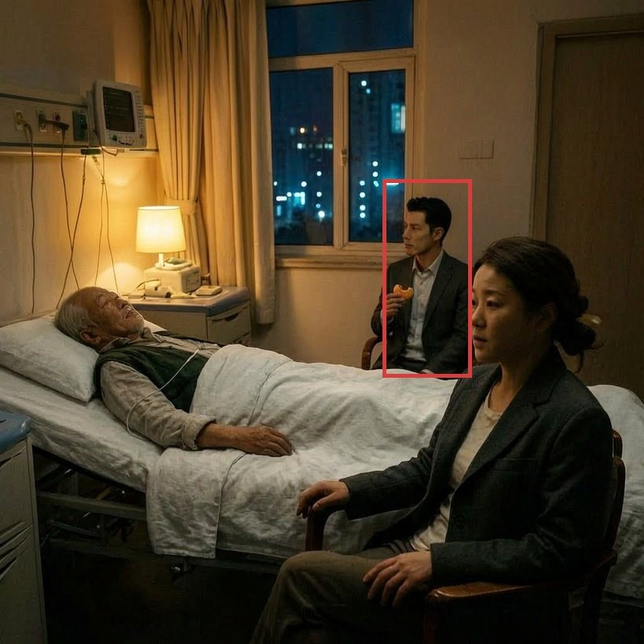</td>
<td>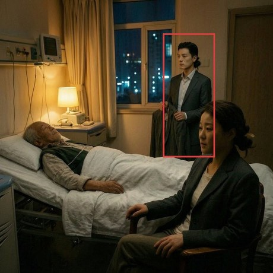</td>
<td>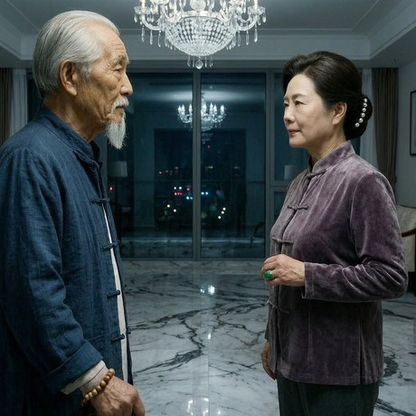</td>
<td>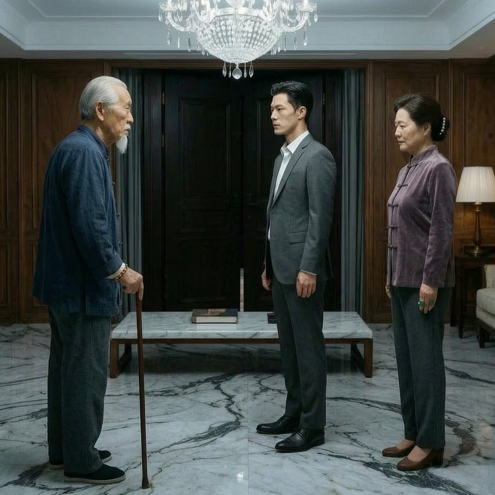</td>
</tr>
<tr>
<td align="center">shot 1</td><td align="center">shot 3</td><td align="center">shot 5</td>
<td align="center">shot 7</td><td align="center">shot 9</td><td align="center">shot 11</td>
</tr>
</table>

### What a tier gap looks like in motion

The same shot of the same episode, three models. The three annotators marked 30, 109 and 94 problems respectively — the top tier holds the character's appearance, the mid tier drifts, the bottom tier loses it outright.

<table>
<tr>
<td width="33%"><a href="assets/video/tier-seedance.mp4"></a></td>
<td width="33%"><a href="assets/video/tier-kling.mp4">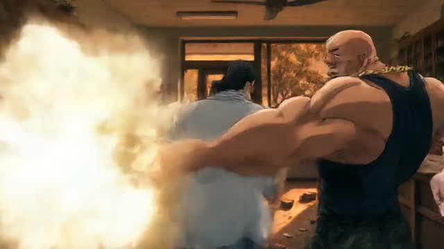</a></td>
<td width="33%"><a href="assets/video/tier-pixverse.mp4">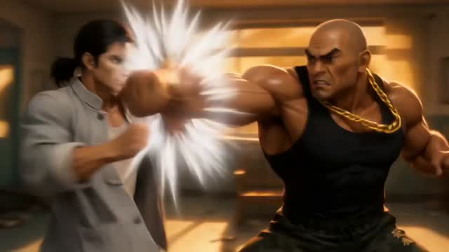</a></td>
</tr>
<tr>
<td><b>Top tier</b> — <code>seedance-2.0</code><br>V-C1 character appearance <b>5.00</b>, 30 problems marked. <a href="assets/video/tier-seedance.mp4">▶ play</a></td>
<td><b>Mid tier</b> — <code>kling-3.0-omni</code><br>V-C1 character appearance <b>2.33</b>, 109 problems marked. <a href="assets/video/tier-kling.mp4">▶ play</a></td>
<td><b>Bottom tier</b> — <code>pixverse-c1</code><br>V-C1 character appearance <b>1.67</b>, 94 problems marked. <a href="assets/video/tier-pixverse.mp4">▶ play</a></td>
</tr>
</table>

Animated drama *Gui Ren*, episode 2, shot 5. Every model receives the same keyframes and the same prompt.

### Shot count decides executability

One identical episode script, forked only at the storyboard stage. All three columns below are verbatim model output covering the *same opening beat* — a question and its answer. At three shots the question is deleted outright and the scene opens on the answer; at six and at twelve it survives in shot 1.

<table>
<tr>
<th width="33%">3 shots — <code>mimo-v2.5-pro</code></th>
<th width="33%">6 shots — <code>gpt-5.5-xhigh</code></th>
<th width="33%">12 shots — <code>claude-opus-4.8-max</code></th>
</tr>
<tr valign="top">
<td>

~~Zhou Zi'an: “How did you know that lyric sheet was in my tape?”~~<br>
**in the script, in none of the three shots**

【Shot 1】 A single take of about **12 s**… closing on the stand-off between 〈Gu Yan〉 and 〈Zhou Zi'an〉. 〈Gu Yan〉 wheels his bicycle in and says:

> “Lin Zhixia's Walkman broke, I took it in for her. When I picked it up there was this mis-copied lyric sheet inside — handwriting with real character.”
>
> *Zhou Zi'an, ears red —* “…Whose handwriting is bad.”
>
> *Qi Xiangbei, quietly —* “The Walkman… I fixed it.”

Four dialogue turns inside one 12 s shot. 1,348 characters over three shots; 4 / 2 / 4 turns; the model's own durations 12 / 10 / 8 s. An annotator, verbatim: “just speaking the lines takes more than 12 s. Straight rejection.”

</td>
<td>

【Shot 1】 Realistic live-action, a fast lateral tracking shot… 〈Gu Yan〉 wheels his bicycle in from frame left, 〈Zhou Zi'an〉 comes up from frame right clutching the slip of paper. 〈Zhou Zi'an〉 says:

> “How did you know that lyric sheet was in my tape?”
>
> *Gu Yan stops the handlebars —* “Lin Zhixia's Walkman broke, I took it in for her.”

【Shot 2】 Handheld, rising off a close-up of the crumpled paper in 〈Zhou Zi'an〉's right hand… 〈Gu Yan〉, flatly:

> “When I picked it up there was this mis-copied lyric sheet inside — handwriting with real character.”
>
> *…* “…Whose handwriting is bad.”

Nothing is dropped, so dialogue fidelity is **5.00**. 2,155 characters over six shots, 2–4 turns each. What the 18 marked problems are about instead is one shot strung with many actions: “shot 4 carries about 8 action beats, density too high”. Executability only 3.00.

</td>
<td>

【Shot 1】 Cinematic realism, a **wide establishing shot**… 〈Gu Yan〉 wheels his bicycle in from frame right; 〈Zhou Zi'an〉 steps up from frame left clutching a crumpled slip, eyebrow raised. 〈Zhou Zi'an〉 says:

> “How did you know that lyric sheet was in my tape?”

【Shot 2】 **Over-shoulder**, the camera crossing 〈Zhou Zi'an〉's right shoulder, focus locked on 〈Gu Yan〉's face. 〈Gu Yan〉 says:

> “Lin Zhixia's Walkman broke, I took it in for her. When I picked it up there was this mis-copied lyric sheet inside — handwriting with real character.”

Question and answer take a shot each, with room left over for two pure reaction shots. 2,769 characters over twelve shots, most carrying a single turn. **Not one** of the 15 marked problems is an omission: “shots 5–6 have no transition designed”, “shots 1–12 repeat the costume description redundantly” — all of them *not good enough* rather than *missing*.

</td>
</tr>
</table>

| Dimension | Axis | `mimo-v2.5-pro`<br>3 shots | `gpt-5.5-xhigh`<br>6 shots | `claude-opus-4.8-max`<br>12 shots | Behaviour |
|---|---|---|---|---|---|
| S-A2 dialogue fidelity | F | *1.33* | **5.00** | **5.00** | stops losing lines at 6 shots |
| S-A1 event coverage | F | *2.67* | **4.67** | **4.67** | same |
| S-B1 executability | P | *1.00* | 3.00 | **4.00** | rises monotonically with shot count |
| S-C2 shooting rhythm | E | *1.00* | **3.67** | **3.67** | 6 shots is already enough |
| Overall impression | | *1.67* | **4.00** | **4.00** | — |
| Problems marked | | 23 | 18 | 15 | fewer, and they change in kind |
| Annotator disagreement | | 1.75 | 0.75 | 0.63 | worse artefacts are harder to score |

The three-shot output compresses the episode into 30 s of self-declared duration and 10 dialogue turns; all three annotators scored its executability and shooting rhythm at 1.00 with zero disagreement, marking the same few defects every time — several actions in one shot, blocking too complex to execute, no reaction shot.

### Difficulty is set by the input paradigm, not the visual style

One shot of one episode, run through all three paradigms end to end. Drama, episode, shot index, storyboard model, image model and video model are held fixed at `gpt-5.5-xhigh` → `gpt-image-2` → `kling-v3-omni`; the only variable is what the video model is handed. Two frames, one grid or five references produce three different stagings of the same beat, a different supporting character on screen, and clips of 12 s, 12 s and 7 s. Failing dimensions across the corpus: 1 of 10 under first/last frame, 9 of 15 under grid.

<table>
<tr>
<th width="33%">first / last frame — 2 inputs</th>
<th width="33%">grid — 1 input</th>
<th width="33%">multi-reference — 5 inputs</th>
</tr>
<tr>
<td></td>
<td>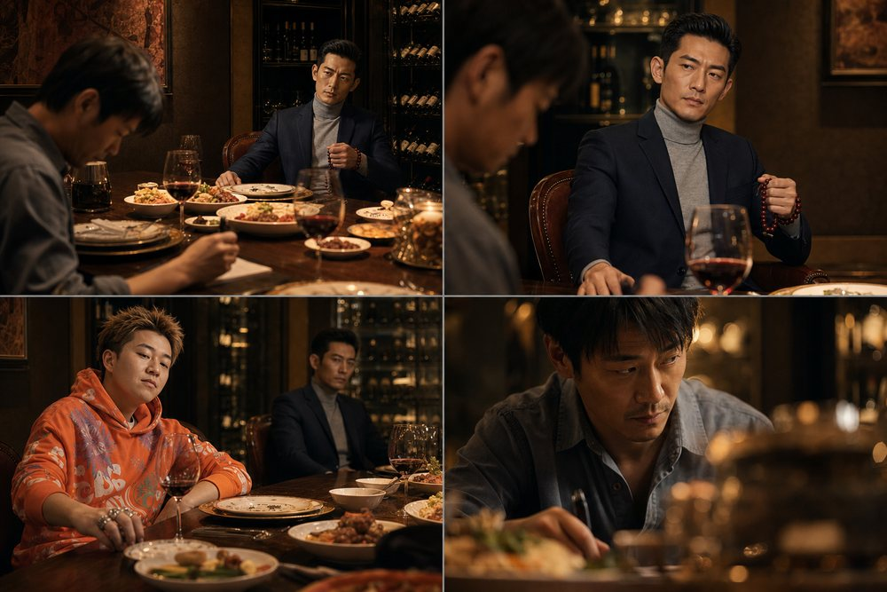</td>
<td>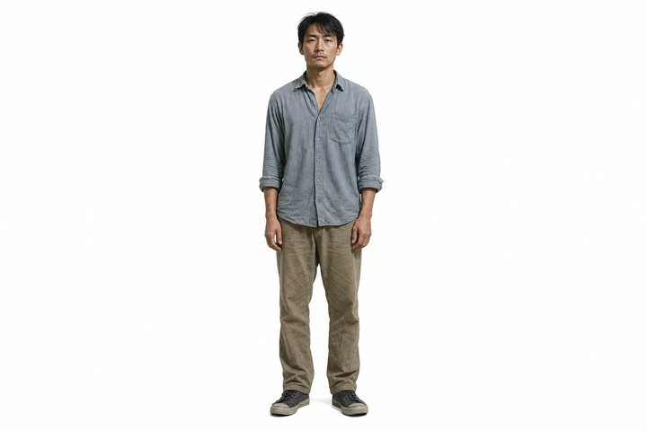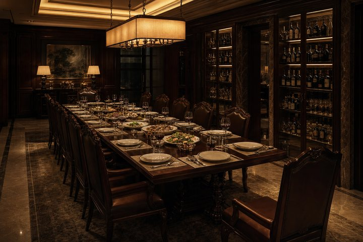</td>
</tr>
<tr>
<td><a href="assets/video/para3-ff.mp4"></a></td>
<td><a href="assets/video/para3-grid.mp4"></a></td>
<td><a href="assets/video/para3-mref.mp4"></a></td>
</tr>
<tr>
<td>Pinned at both ends, the clip only has to travel between two fixed compositions. It drifts off the document and lands on the seated man exactly as the last frame specifies — a camera move, not a scene. <a href="assets/video/para3-ff.mp4">▶ play</a></td>
<td>Four cuts arrive as one 2×2 image, so the model reads its own coverage off the panels — a wide two-shot across the dinner table, nothing like the close-up on the left. <a href="assets/video/para3-grid.mp4">▶ play</a></td>
<td>No frame is given at all — characters, set and props arrive as three separate channels and the framing is left open. Su Jinxiu, referenced here and in neither of the other two runs, is the only one of the three clips she appears in. It runs 7 s, not 12. <a href="assets/video/para3-mref.mp4">▶ play</a></td>
</tr>
</table>

Live-action *Zhui Xu Wu Feng*, episode 1, shot 3. The thumbnails above each clip are the complete input for that paradigm — there is nothing else. Six models were evaluated under first/last frame, four under grid and five under multi-reference; a fourth paradigm, multi-keyframe, is defined but not run this round.

### An upstream defect is re-expressed downstream, not repaired

Rooms drift before people do: all three annotators circled this run for the set dressing while the characters held. The video stage does not repair such a drift — it re-expresses it, and it survives into the finished drama.

**`gpt-image-1.5`**, four consecutive shots — MI-D3 scene **2.00** vs MI-D1 character **3.67**

<table>
<tr>
<td>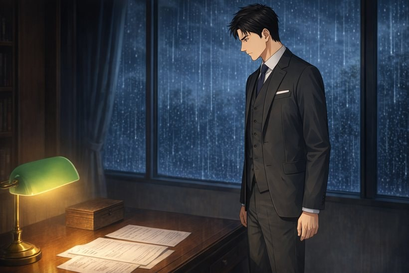</td>
<td>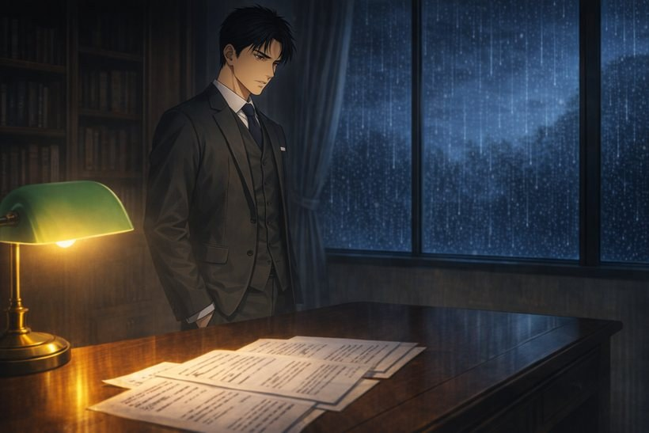</td>
<td>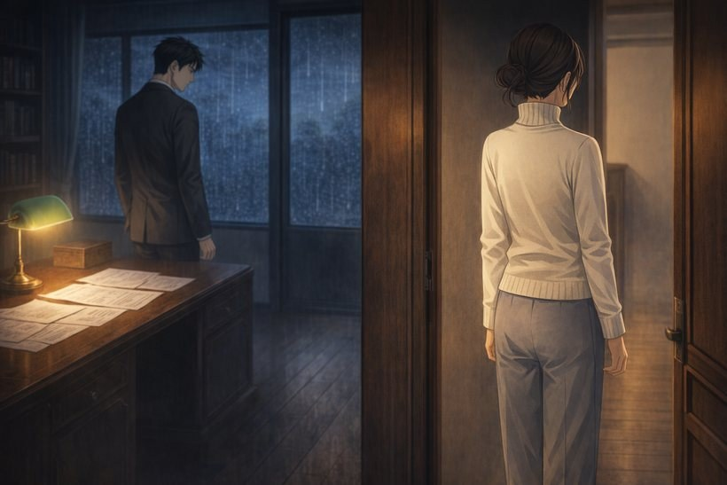</td>
<td>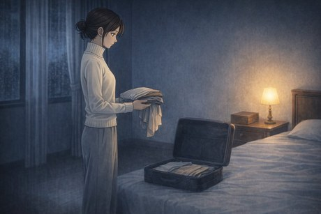</td>
</tr>
<tr>
<td align="center">shot 1</td><td align="center">shot 2</td>
<td align="center">shot 3</td><td align="center">shot 4</td>
</tr>
</table>

### `hy3` reproduces the script and does not dramatise it

It scores 3.43 against 3.60 for its nearest neighbour `doubao-seed-2.1-pro`, and the gap is grouped rather than general: it leads on everything that means *reproduce the script* (dialogue fidelity 4.44) and trails on everything that means *turn it into television* (emotion 3.64, audiovisual style 3.91, both eighth of nine).

### `seedance-2.5` buys episode coherence with single-clip quality

On paired items the newer version loses on single-shot video and gains at episode and short-drama granularity. Everything that must hold along a timeline got worse (audio-visual sync −0.658, motion smoothness, camera plausibility); everything about joining shots got better (cross-shot style consistency +1.143). It follows the prompt more literally, so a deficiency already in the prompt is now executed faithfully.

<table>
<tr>
<td width="50%"><a href="assets/video/sd25-lipsync.mp4">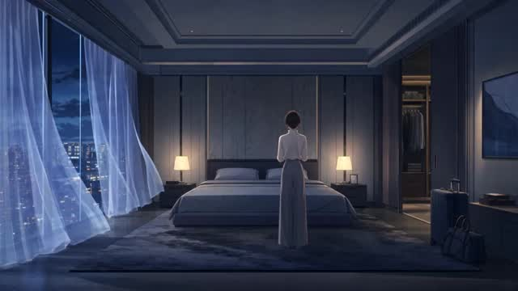</a></td>
<td width="50%"><a href="assets/video/sd25-cuts.mp4"></a></td>
</tr>
<tr>
<td><b>The prompt said film her from behind, so it did.</b> There is no mouth to sync the dialogue to. <a href="assets/video/sd25-lipsync.mp4">▶ play</a></td>
<td><b>Four internal cuts inside one 25 s shot.</b> Single shots went from 15 s to 30 s while the score stays one number. <a href="assets/video/sd25-cuts.mp4">▶ play</a></td>
</tr>
</table>

### Automated scoring drifts where there is no reference to check against

Every dimension with a reference to check against is right; the one purely perceptual dimension is off by almost four points in the lenient direction. The three annotators scored technical quality 1 / 1 / 2 and tagged it consistently — structural distortion, noise, blur, ghosting.

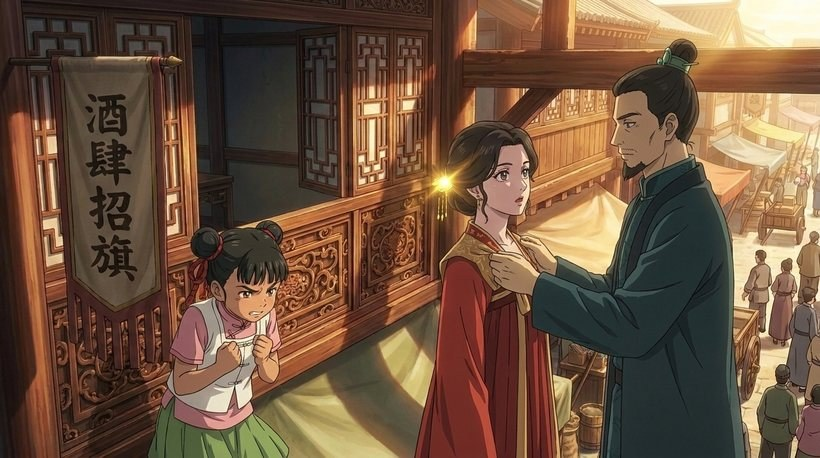

| Dimension | human | judge | err | |
|---|---|---|---|---|
| I-B1 subject attributes | 2.00 | 2 | 0.00 | correct |
| I-C2 appearance, costume | 2.33 | 2 | 0.33 | correct |
| I-B3 scene and layout | 2.67 | 3 | 0.33 | correct |
| I-A1 technical quality | *1.33* | *5* | *3.67* | **overestimated** |

---

## Release

DramaChain Bench supports extensible evaluation rather than static benchmarking. Stage-level branching plus model-consistent automatic scoring lets a new model enter the board with single-stage generation only, requiring no additional human annotation.

We will release **DramaChain Dimensions**, the **DramaChain Agentic Judge** framework, and a curated subset of the benchmark data.

## Citation

```bibtex
@techreport{shi2026dramachain,
  title       = {DramaChain Bench: An End-to-End Benchmark for Short-Drama Generation},
  author      = {Shi, Haoyuan and Chen, Mingtao and Jiang, Shuo and Chen, Ziyan and
                 Sheng, Xuyi and Liu, Yiming and Zhang, Ying and Wang, Miao and
                 Lu, Jianxiang and Lu, Fanyang and Lu, Songyuanyi and Wu, Xiele and
                 Hu, Zhichao and Wang, Lilin and Liu, Yuhong and Xuan, Richeng},
  institution = {Hunyuan, Tencent},
  year        = {2026}
}
```
