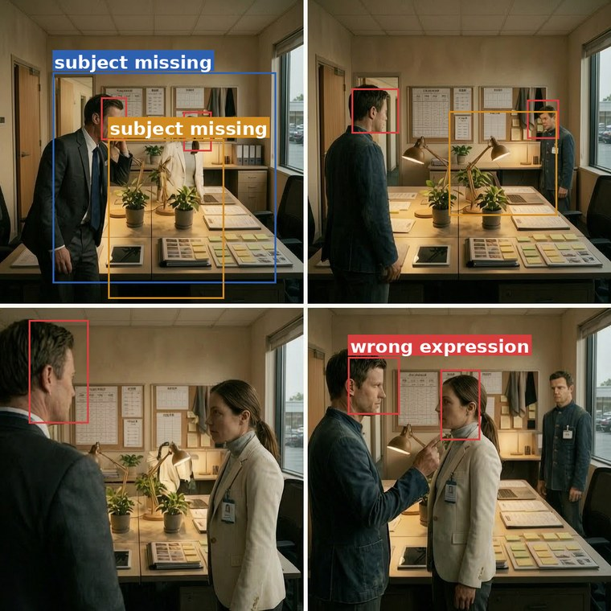
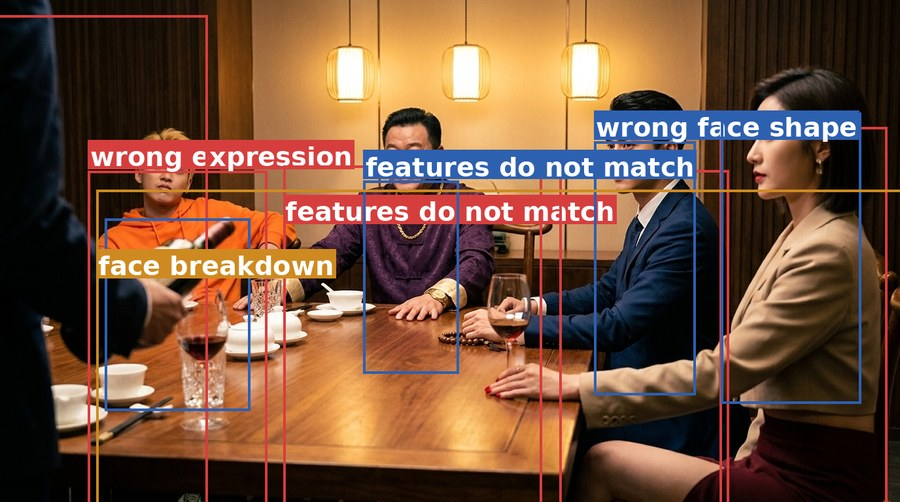
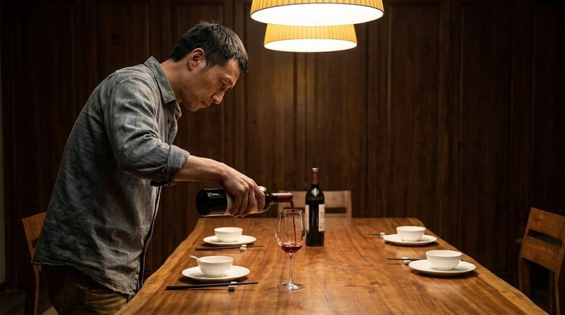
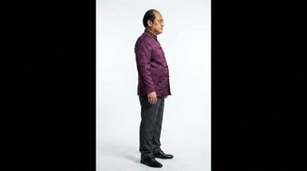
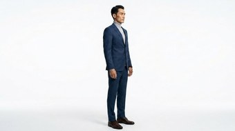
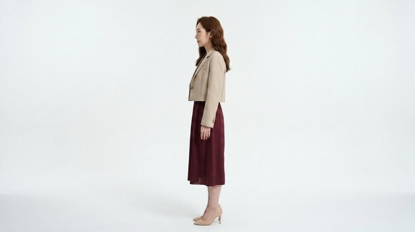

<div align="center">

# DramaChain Bench

### An End-to-End Benchmark for Short-Drama Generation

**From Production Pipeline and Annotation System to Validated Automated Evaluation**

Haoyuan Shi<sup>1</sup> &nbsp; Mingtao Chen<sup>1</sup> &nbsp; Shuo Jiang<sup>1</sup> &nbsp; Ziyan Chen<sup>1,2</sup><br>
Xuyi Sheng<sup>3</sup> &nbsp; Yiming Liu<sup>1</sup> &nbsp; Ying Zhang<sup>1</sup> &nbsp; Miao Wang<sup>1,4</sup><br>
Jianxiang Lu<sup>1</sup> &nbsp; Fanyang Lu<sup>1</sup> &nbsp; Songyuanyi Lu<sup>1</sup> &nbsp; Xiele Wu<sup>1</sup><br>
Zhichao Hu<sup>1,†</sup> &nbsp; Lilin Wang<sup>1</sup> &nbsp; Yuhong Liu<sup>1</sup> &nbsp; Richeng Xuan<sup>1,§</sup>

<sup>1</sup>Hunyuan, Tencent &nbsp;&nbsp; <sup>2</sup>Beijing Film Academy &nbsp;&nbsp; <sup>3</sup>Peking University &nbsp;&nbsp; <sup>4</sup>Shenzhen University

<sup>†</sup>Project Lead &nbsp;&nbsp; <sup>§</sup>Corresponding Author

</div>

---

## Abstract

Commercial short-drama production runs as a chain — script, storyboard, keyframes, shot video, finished drama — but benchmarks score only the video stage, on inputs written for the test rather than produced by a pipeline. So no one can say which stage caused a delivery defect, or how far it travelled.

**DramaChain Bench** scores every stage of a full production chain, on items that chain itself produced. Five evaluation axes are instantiated at six granularities into 63 leaf dimensions, over 5,785 items. Three professional annotators score each item independently with every defect localised in space and time, giving 17,488 scores and 255,925 traceable attributions. An agentic judge then reproduces that board at a mean PLCC of 0.918 — enough to admit new models at no annotation cost.

<div align="center">

</div>

---

## Highlights

- **The best chain today barely clears the usable line.** `gpt-5.5-xhigh` → `gpt-image-2` → `seedance-2.0` delivers a finished drama at 3.30, only 0.3 above 3.0.
- **Upstream defects accumulate rather than stay local.** Degrading one upstream stage costs a single clip 0.07–0.13 points but the finished drama 0.25–0.83.
- **Quality decays along the chain.** 3.78 at storyboard design down to 2.93 at episode video; no pixel or video stage reaches the text stage's mean.
- **Composite scores hide dimensional trade-offs.** `seedream-5.0-pro` and `nano-banana-pro` differ by 0.02 overall, but by 0.39 and 0.60 on two axes in opposite directions.

---

## Leaderboard

Automated board, 5-point scale, over six production stages and five evaluation axes. **All** is the cross-axis composite.

| Notation | Meaning |
|---|---|
| **bold** | best value in the column among fully annotated models |
| *italic* | below the 3.0 usable line |
| — | axis not defined at this stage |
| † | added after the annotation round, scored automatically only; excluded from agreement metrics and best-column marking |
| ‡ | partial corpus run (reduced dramas, paradigms or styles); scores from the evaluated subset |

Stage headers give model-level PLCC and SRCC against the three-annotator human board.

<details open>
<summary><b>① Storyboard design</b> &nbsp;·&nbsp; text → text &nbsp;·&nbsp; PLCC 0.936 &nbsp;·&nbsp; SRCC 0.800</summary>

<br>

| Model | F<br>Input fidelity | C<br>Internal consistency | P<br>Generation plausibility | Q<br>Visual quality | E<br>Cinematic expressiveness | All |
|---|---|---|---|---|---|---|
| `gpt-5.5-xhigh` | **4.84** | — | **3.89** | — | 4.10 | **4.23** |
| `claude-opus-4.8-max` | 4.51 | — | 3.80 | — | **4.19** | 4.17 |
| `hy3` | 4.36 | — | 3.65 | — | 3.78 | 3.89 |
| `doubao-seed-2.1-pro` | 4.26 | — | 3.65 | — | 3.82 | 3.89 |
| `glm-5.2` | 4.01 | — | 3.66 | — | 3.74 | 3.79 |
| `gemini-3.1-pro` | 4.08 | — | 3.43 | — | 3.67 | 3.71 |
| `kimi-k2.6` | 3.66 | — | 3.42 | — | 3.74 | 3.64 |
| `qwen3.7-max` | 3.24 | — | 3.48 | — | 3.59 | 3.48 |
| `mimo-v2.5-pro` | *2.68* | — | 3.53 | — | 3.41 | 3.26 |
| `gpt-5.6-sol-max` † | 4.95 | — | 4.02 | — | 4.31 | 4.40 |
| `claude-fable-5-max` † | 4.55 | — | 3.99 | — | 4.20 | 4.24 |
| `claude-opus-5-max` † | 4.45 | — | 3.85 | — | 4.30 | 4.22 |
| `kimi-k3` † | 4.67 | — | 3.87 | — | 4.17 | 4.22 |
| `qwen3.8-max` † | 4.55 | — | 3.88 | — | 3.94 | 4.08 |
| `grok-4.5` † | 3.96 | — | 3.85 | — | 3.92 | 3.92 |
| `gemini-3.6-flash-high` † | 4.04 | — | 3.65 | — | 3.71 | 3.78 |

</details>

<details>
<summary><b>② Single keyframe</b> &nbsp;·&nbsp; text + refs → pixels &nbsp;·&nbsp; PLCC 0.959 &nbsp;·&nbsp; SRCC 0.750</summary>

<br>

| Model | F<br>Input fidelity | C<br>Internal consistency | P<br>Generation plausibility | Q<br>Visual quality | E<br>Cinematic expressiveness | All |
|---|---|---|---|---|---|---|
| `gpt-image-2` | **3.65** | **4.32** | **4.47** | **4.13** | — | **3.99** |
| `gpt-image-1.5` | 3.25 | 3.96 | 4.46 | 3.90 | — | 3.72 |
| `nano-banana-2` | 3.33 | 3.92 | 4.25 | 3.71 | — | 3.68 |
| `seedream-5.0-pro` | 3.56 | 3.92 | 3.74 | 3.52 | — | 3.64 |
| `nano-banana-pro` | 3.17 | 3.89 | 4.34 | 3.79 | — | 3.62 |
| `wan2.7-image-pro` | *2.95* | 3.63 | 4.03 | 3.46 | — | 3.38 |
| `seedream-5.0-lite` ‡ | *2.96* | 3.40 | 3.89 | 3.40 | — | 3.32 |

</details>

<details>
<summary><b>③ Episode keyframes</b> &nbsp;·&nbsp; a whole episode of frames &nbsp;·&nbsp; PLCC 0.973 &nbsp;·&nbsp; SRCC 0.964</summary>

<br>

| Model | F<br>Input fidelity | C<br>Internal consistency | P<br>Generation plausibility | Q<br>Visual quality | E<br>Cinematic expressiveness | All |
|---|---|---|---|---|---|---|
| `gpt-image-2` | — | **3.82** | — | — | — | **3.82** |
| `gpt-image-1.5` | — | 3.60 | — | — | — | 3.60 |
| `nano-banana-2` | — | 3.47 | — | — | — | 3.47 |
| `seedream-5.0-pro` | — | 3.28 | — | — | — | 3.28 |
| `nano-banana-pro` | — | 3.04 | — | — | — | 3.04 |
| `wan2.7-image-pro` | — | 3.00 | — | — | — | 3.00 |
| `seedream-5.0-lite` ‡ | — | *2.91* | — | — | — | *2.91* |

</details>

<details>
<summary><b>④ Single-shot video</b> &nbsp;·&nbsp; pixels → time + audio &nbsp;·&nbsp; PLCC 0.755 &nbsp;·&nbsp; SRCC 0.829</summary>

<br>

| Model | F<br>Input fidelity | C<br>Internal consistency | P<br>Generation plausibility | Q<br>Visual quality | E<br>Cinematic expressiveness | All |
|---|---|---|---|---|---|---|
| `seedance-2.0` ‡ | 3.44 | **3.27** | 3.06 | **3.77** | 3.05 | **3.24** |
| `happyhorse-1.1` | 3.34 | 3.21 | 3.04 | 3.43 | 3.08 | 3.18 |
| `kling-3.0-omni` | 3.22 | 3.23 | **3.08** | 3.28 | *2.88* | 3.11 |
| `pixverse-c1` | 3.07 | 3.09 | *2.92* | 3.42 | **3.10** | 3.10 |
| `wan2.7` ‡ | **3.45** | *2.96* | *2.87* | 3.22 | *2.92* | 3.04 |
| `veo-3.1` ‡ | 3.17 | *2.77* | *2.73* | 3.32 | *2.76* | *2.88* |
| `seedance-2.5` †‡ | 3.24 | 3.40 | *2.97* | 3.71 | *2.85* | 3.17 |

</details>

<details>
<summary><b>⑤ Episode video</b> &nbsp;·&nbsp; shots in sequence &nbsp;·&nbsp; PLCC 0.935 &nbsp;·&nbsp; SRCC 0.943</summary>

<br>

| Model | F<br>Input fidelity | C<br>Internal consistency | P<br>Generation plausibility | Q<br>Visual quality | E<br>Cinematic expressiveness | All |
|---|---|---|---|---|---|---|
| `seedance-2.0` ‡ | — | ***2.96*** | 3.41 | — | 3.32 | **3.11** |
| `happyhorse-1.1` | — | *2.84* | **3.64** | — | 3.37 | 3.08 |
| `kling-3.0-omni` | — | *2.79* | 3.31 | — | **3.48** | 3.06 |
| `wan2.7` ‡ | — | *2.57* | 3.24 | — | 3.35 | *2.87* |
| `veo-3.1` ‡ | — | *2.47* | 3.27 | — | 3.18 | *2.76* |
| `pixverse-c1` | — | *2.42* | 3.08 | — | 3.16 | *2.71* |
| `seedance-2.5` †‡ | — | 3.16 | 3.11 | — | 3.50 | 3.25 |

</details>

<details>
<summary><b>⑥ Short drama</b> &nbsp;·&nbsp; the finished short drama &nbsp;·&nbsp; PLCC 0.947 &nbsp;·&nbsp; SRCC 1.000</summary>

<br>

| Model | F<br>Input fidelity | C<br>Internal consistency | P<br>Generation plausibility | Q<br>Visual quality | E<br>Cinematic expressiveness | All |
|---|---|---|---|---|---|---|
| `seedance-2.0` ‡ | **4.29** | 3.38 | — | — | *2.68* | **3.30** |
| `happyhorse-1.1` | 3.82 | 3.38 | — | — | ***2.69*** | 3.22 |
| `kling-3.0-omni` | 3.37 | **3.41** | — | — | *2.54* | 3.11 |
| `wan2.7` ‡ | 4.12 | *2.80* | — | — | *2.59* | *2.95* |
| `pixverse-c1` | 3.05 | *2.88* | — | — | *2.58* | *2.81* |
| `veo-3.1` ‡ | *2.67* | 3.07 | — | — | *2.44* | *2.79* |
| `seedance-2.5` †‡ | 4.40 | 3.93 | — | — | 3.00 | 3.70 |

</details>

> Absolute scores for single-shot video and episode keyframes are **not** comparable with the other granularities, because dimensions were retired from those scales. The main text reports raw means; the covariate-adjusted variant differs by up to 0.11 points.

---

## The three systems

### DramaChain Agent — item sourcing

<div align="center">

</div>

An end-to-end short-drama production pipeline running fully automatically. It generates the 20 dramas and 60 episodes the benchmark rests on, and both its workflow and its finished-drama quality are calibrated against real commercial platforms, so that a flawed pipeline does not itself become the object of evaluation. The framework forks at exactly the stage under test: competing models receive identical upstream artefacts and prompt strings while every other stage stays fixed.

### DramaChain Labeling System — human reference

<div align="center">

</div>

Three professional annotators independently score every item on all applicable dimensions, using a five-point decidable rubric per leaf dimension. Rubric tiers define observable criteria mapped to a closed vocabulary of attribution tags, and every deduction is localised in space and time. The result is 17,488 scores and 255,925 reviewable attributions contributed by 543 annotators.

### DramaChain Agentic Judge — automated evaluation

<div align="center">

</div>

The judge replicates the human reference automatically. It aggregates routed measurements derived from dimension-specific criteria, may invoke external tools across multiple rounds, and produces final judgements against a per-item checklist. Mean PLCC against the human panel is 0.918.

---

## Case studies

### Equal scores, different failure modes

All four items score 1.3–1.7 on some dimension, so a composite ranks them together. The boxes fall in four disjoint places, and within each pair the two models trade which dimension they fail.

<table>
<tr>
<td width="40%"></td>
<td width="60%"></td>
</tr>
<tr>
<td><code>wan2.7-image-pro</code> — I-C1 face identity <b>1.67</b>, 15 boxes, every one on a face; action interaction scored 3.0.</td>
<td><code>gpt-image-1.5</code> — I-B2 action interaction <b>1.33</b>, 13 boxes, every one on a limb; face identity scored 3.33.</td>
</tr>
<tr>
<td></td>
<td></td>
</tr>
<tr>
<td><code>seedream-5.0-lite</code> — I-B1 subject attributes <b>1.33</b>, 12 boxes, all “extra subject”; human anatomy scored 3.0.</td>
<td><code>wan2.7-image-pro</code> — I-E1 human anatomy <b>1.33</b>, 10 boxes, all broken hands; subject attributes scored 3.33.</td>
</tr>
</table>

Boxes are drawn independently by the three annotators; colour distinguishes them.

### Cross-shot consistency is a separate capability

Same episode, same character sheets. The top row holds its two leads across shots and the bottom row does not — a 2.66-point gap. Every panel in the failing row is defensible on its own: nothing in shot 7 is wrong except relative to shot 5.

**T1 `gpt-image-2`** — MI-D1 cross-shot character consistency **4.33**, alternate shots 1, 3, … 11 of 13

<table>
<tr>
<td></td>
<td></td>
<td></td>
<td></td>
<td></td>
<td></td>
</tr>
<tr>
<td align="center">shot 1</td><td align="center">shot 3</td><td align="center">shot 5</td>
<td align="center">shot 7</td><td align="center">shot 9</td><td align="center">shot 11</td>
</tr>
</table>

**T4 `wan2.7-image-pro`** — MI-D1 cross-shot character consistency **1.67**

<table>
<tr>
<td></td>
<td></td>
<td></td>
<td></td>
<td></td>
<td></td>
</tr>
<tr>
<td align="center">shot 1</td><td align="center">shot 3</td><td align="center">shot 5</td>
<td align="center">shot 7</td><td align="center">shot 9</td><td align="center">shot 11</td>
</tr>
</table>

### What a tier gap looks like in motion

The same shot of the same episode, three models. The three annotators marked 30, 109 and 94 problems respectively — the top tier holds the character's appearance, the mid tier drifts, the bottom tier loses it outright.

<table>
<tr>
<td width="33%"><a href="assets/video/tier-seedance.mp4"></a></td>
<td width="33%"><a href="assets/video/tier-kling.mp4"></a></td>
<td width="33%"><a href="assets/video/tier-pixverse.mp4"></a></td>
</tr>
<tr>
<td><b>Top tier</b> — <code>seedance-2.0</code><br>V-C1 character appearance <b>5.00</b>, 30 problems marked. <a href="assets/video/tier-seedance.mp4">▶ play</a></td>
<td><b>Mid tier</b> — <code>kling-3.0-omni</code><br>V-C1 character appearance <b>2.33</b>, 109 problems marked. <a href="assets/video/tier-kling.mp4">▶ play</a></td>
<td><b>Bottom tier</b> — <code>pixverse-c1</code><br>V-C1 character appearance <b>1.67</b>, 94 problems marked. <a href="assets/video/tier-pixverse.mp4">▶ play</a></td>
</tr>
</table>

Animated drama *Gui Ren*, episode 2, shot 5. Every model receives the same keyframes and the same prompt.

### Shot count decides executability

One identical episode script, forked only at the storyboard stage:

| Dimension | Axis | `mimo-v2.5-pro`<br>3 shots | `gpt-5.5-xhigh`<br>6 shots | `claude-opus-4.8-max`<br>12 shots | Behaviour |
|---|---|---|---|---|---|
| S-A2 dialogue fidelity | F | *1.33* | **5.00** | **5.00** | stops losing lines at 6 shots |
| S-A1 event coverage | F | *2.67* | **4.67** | **4.67** | same |
| S-B1 executability | P | *1.00* | 3.00 | **4.00** | rises monotonically with shot count |
| S-C2 shooting rhythm | E | *1.00* | **3.67** | **3.67** | 6 shots is already enough |
| Overall impression | | *1.67* | **4.00** | **4.00** | — |
| Problems marked | | 23 | 18 | 15 | fewer, and they change in kind |
| Annotator disagreement | | 1.75 | 0.75 | 0.63 | worse artefacts are harder to score |

The three-shot output compresses the episode into 30 s of self-declared duration and 10 dialogue turns; all three annotators scored its executability and shooting rhythm at 1.00 with zero disagreement, marking the same few defects every time — several actions in one shot, blocking too complex to execute, no reaction shot.

### Each input paradigm carries its own failure mode

Grid panels omit people; first/last-frame shots change person between the two frames. Neither failure is available to the other paradigm, which is why difficulty is set by paradigm rather than visual style — 1 of 10 failing dimensions against 9 of 15.

<table>
<tr>
<td width="42%"></td>
<td width="58%"></td>
</tr>
<tr>
<td><b>Grid panel omits people.</b> <code>wan2.7-image-pro</code>, I-B1 subject attributes <b>1.33</b>: cells that should hold three people hold two.</td>
<td><b>First/last frame changes person between frames.</b> <code>nano-banana-pro</code>, I-C1 face identity <b>1.33</b>: three annotators boxed it independently, and <em>nothing constrains the last frame against the first</em>.</td>
</tr>
</table>

The input for the first/last-frame case — the shot's own first frame, then three character sheets:

<table>
<tr>
<td></td>
<td></td>
<td></td>
<td></td>
</tr>
<tr>
<td align="center">first frame</td><td align="center">character sheet</td>
<td align="center">character sheet</td><td align="center">character sheet</td>
</tr>
</table>

### An upstream defect is re-expressed downstream, not repaired

Rooms drift before people do: all three annotators circled this run for the set dressing while the characters held. The video stage does not repair such a drift — it re-expresses it, and it survives into the finished drama.

**`gpt-image-1.5`**, four consecutive shots — MI-D3 scene **2.00** vs MI-D1 character **3.67**

<table>
<tr>
<td></td>
<td></td>
<td></td>
<td></td>
</tr>
<tr>
<td align="center">shot 1</td><td align="center">shot 2</td>
<td align="center">shot 3</td><td align="center">shot 4</td>
</tr>
</table>

### `hy3` reproduces the script and does not dramatise it

It scores 3.43 against 3.60 for its nearest neighbour `doubao-seed-2.1-pro`, and the gap is grouped rather than general: it leads on everything that means *reproduce the script* (dialogue fidelity 4.44) and trails on everything that means *turn it into television* (emotion 3.64, audiovisual style 3.91, both eighth of nine).

### `seedance-2.5` buys episode coherence with single-clip quality

On paired items the newer version loses on single-shot video and gains at episode and short-drama granularity. Everything that must hold along a timeline got worse (audio-visual sync −0.658, motion smoothness, camera plausibility); everything about joining shots got better (cross-shot style consistency +1.143). It follows the prompt more literally, so a deficiency already in the prompt is now executed faithfully.

<table>
<tr>
<td width="50%"><a href="assets/video/sd25-lipsync.mp4"></a></td>
<td width="50%"><a href="assets/video/sd25-cuts.mp4"></a></td>
</tr>
<tr>
<td><b>The prompt said film her from behind, so it did.</b> There is no mouth to sync the dialogue to. <a href="assets/video/sd25-lipsync.mp4">▶ play</a></td>
<td><b>Four internal cuts inside one 25 s shot.</b> Single shots went from 15 s to 30 s while the score stays one number. <a href="assets/video/sd25-cuts.mp4">▶ play</a></td>
</tr>
</table>

### Automated scoring drifts where there is no reference to check against

Every dimension with a reference to check against is right; the one purely perceptual dimension is off by almost four points in the lenient direction. The three annotators scored technical quality 1 / 1 / 2 and tagged it consistently — structural distortion, noise, blur, ghosting.


| Dimension | human | judge | err | |
|---|---|---|---|---|
| I-B1 subject attributes | 2.00 | 2 | 0.00 | correct |
| I-C2 appearance, costume | 2.33 | 2 | 0.33 | correct |
| I-B3 scene and layout | 2.67 | 3 | 0.33 | correct |
| I-A1 technical quality | *1.33* | *5* | *3.67* | **overestimated** |

---

## Release

DramaChain Bench supports extensible evaluation rather than static benchmarking. Stage-level branching plus model-consistent automatic scoring lets a new model enter the board with single-stage generation only, requiring no additional human annotation.

We will release **DramaChain Dimensions**, the **DramaChain Agentic Judge** framework, and a curated subset of the benchmark data.

## Citation

```bibtex
@techreport{shi2026dramachain,
  title       = {DramaChain Bench: An End-to-End Benchmark for Short-Drama Generation},
  author      = {Shi, Haoyuan and Chen, Mingtao and Jiang, Shuo and Chen, Ziyan and
                 Sheng, Xuyi and Liu, Yiming and Zhang, Ying and Wang, Miao and
                 Lu, Jianxiang and Lu, Fanyang and Lu, Songyuanyi and Wu, Xiele and
                 Hu, Zhichao and Wang, Lilin and Liu, Yuhong and Xuan, Richeng},
  institution = {Hunyuan, Tencent},
  year        = {2026}
}
```
